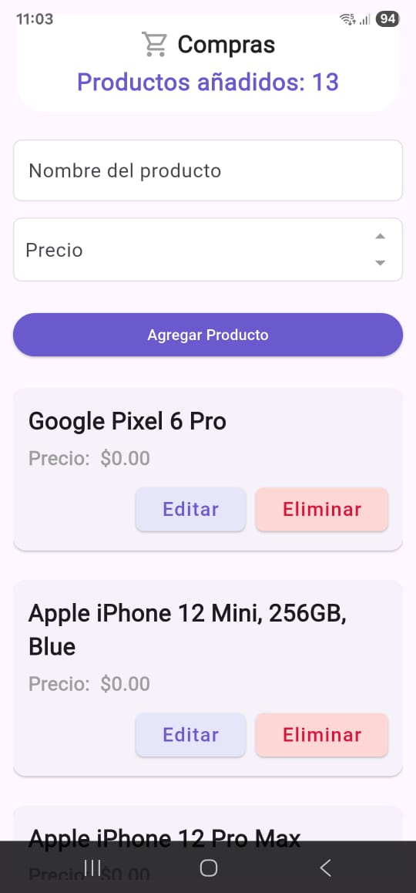
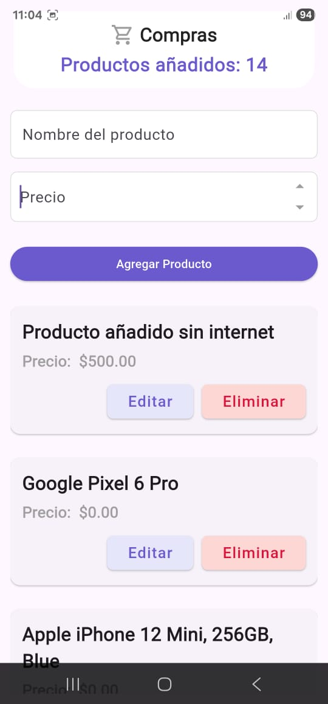
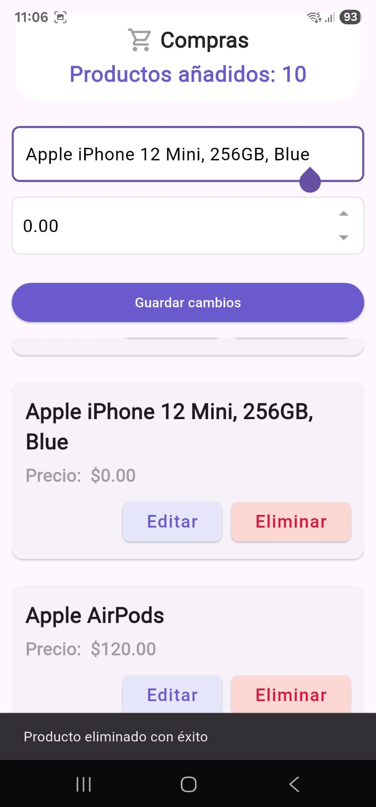
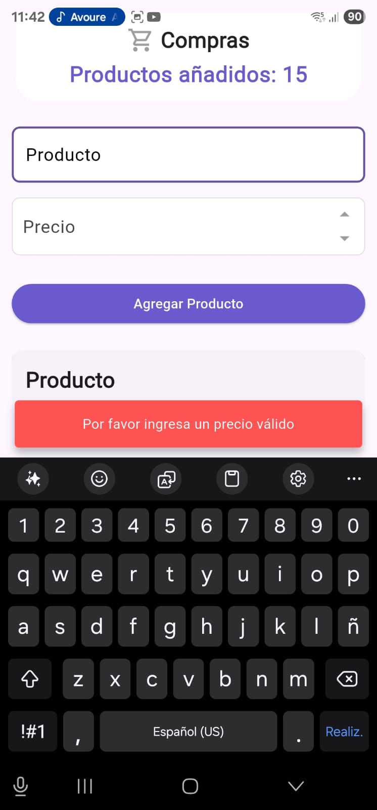

# Smart List

Smart List es una aplicación para administrar productos, permitiendo agregar, editar, eliminar y sincronizar con un backend remoto y base de datos local.

---

## Descripción

La aplicación permite:
- Crear nuevos productos con nombre y precio.
- Editar productos existentes.
- Eliminar productos de manera local o remota.
- Sincronizar productos entre la base de datos local y un servidor remoto.
- Visualizar productos en una lista organizada.

---

## Implementación

- **Frontend:** Flutter, usando Widgets personalizados (`CustomShoppingAppBar`,`ProductForm`, `ProductCard`) y Clean Architecture.
- **Backend:** API REST para productos (simulado con `ProductRemoteRepository`).
- **Base de datos local:** SQLite usando `sqflite`.
- **Sincronización:** `SyncService` que verifica conexión a internet, obtiene productos del remoto, envía productos locales no sincronizados y borra productos eliminados.

**Decisiones importantes:**
- Se usa Clean Architecture para separar dominio, data y presentación.
- `ProductForm` es un widget reutilizable que sirve tanto para agregar como para editar productos.
- Se implementa verificación de conexión a internet antes de enviar o recibir datos del servidor.
- El flujo de sincronización garantiza integridad de datos y evita sobrescribir información.

---

## Capturas de pantalla

Pantalla principal de la aplicación:

Formulario para agregar productos:

Formulario para editar productos y mensaje de confirmación:

Mensaje de error:

## Video de ejución
https://drive.google.com/file/d/1pWaazIQTmPTGQTu2YCD-h-wdNvWUMA8G/view?usp=drive_link

---

## Cómo ejecutar

1. Clonar el repositorio:

git clone https://github.com/DVeliz99/SmartList.git
cd smart_list

2. Instalar dependencias:

flutter pub get

3. Ejecutar la app:

flutter run

Estructura del proyecto
lib/
 ├─ core/             # Servicios, configuraciones y utilidades
 ├─ data/             # Repositorios, datasource, API y SQLite 
 ├─ domain/           # Entidades 
 ├─ presentation/     # Pantallas y widgets
 └─ use_cases/        # Casos de uso
assets/
 └─ screenshots/      # y capturas de pantalla
 └─ fonts/            # fuente de texto 

 